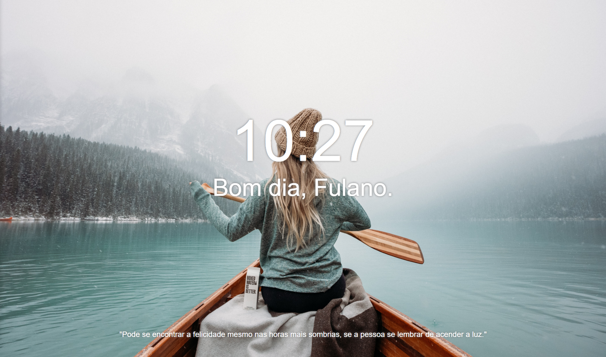

# Criando a página do Momentum

Recriação da página da famosa extensão chamada Momentum

## Objetivo do desafio

Praticar os conceitos de montagem de página em HTML&CSS através da criação de uma interface que usa a página inteira, com itens em posições específicas.

Uma observação importante é que o autor da frase não pode aparecer, exceto quando passar o mouse sob a frase, aí ele aparece lentamente, em animação de cima pra baixo.

## Regras do desafio

- A página deve ser completamente responsiva.
- O autor da frase só aparece se passar o mouse na frase
- Ao aparecer o autor, o tempo não pode mudar de posição
- A imagem deve cobrir toda a tela disponível
- A fonte principal é Helvetica

